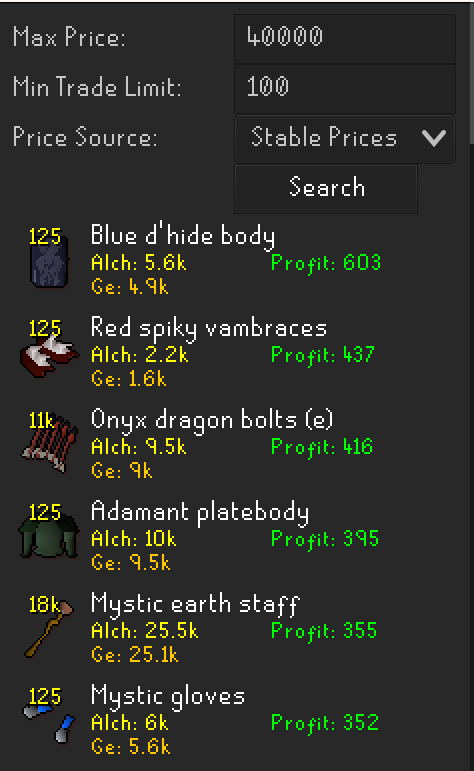
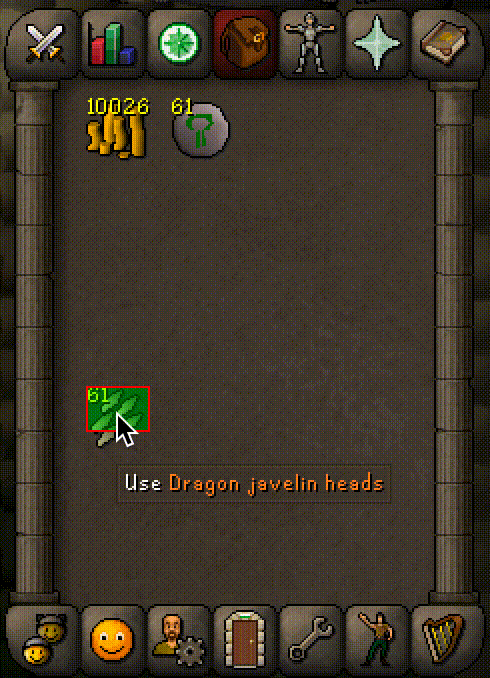

# ABC Alchemy

*Always be casting* alchemy.

## GE Alch Calculator

This plugin adds an alchemy calculator to the RuneLite sidebar that lets you quickly see which items are most profitable for Alchemy. 

There are currently two sources of GE Prices:

* **Wiki Prices:** These prices are updated every few minutes, via trades made by other RuneLite users. [See RuneLite announcement](https://runelite.net/blog/show/2021-03-08-Wiki-Ge-Partnership/).
* **Stable Prices:** These are the standard prices set by Jagex in the Grand Exchange.

## Alchemy Helper

While casting alchemy, a screen marker is placed over the intersection between the alch spell and the inventory slot it most overlaps with. 

Inside of this indicator, a loading bar shows the progress until the next tick. Additionally, you can turn on sound indicators that play on the tick when you can next cast alchemy. These can be helpful for tick manipulation, helping you cast alchemy while doing other tasks.

If the mouse is not over the intersection point while you are casting the alch spell or if your inventory is visible without a spell pending, the indicator will turn red to inform you that you are misclicking.

The overlay will disappear after 1 minute without casting alchemy.

## FAQ

### Does this plugin support Low Alch or Explorer's ring?

Currently as I prioritize which features to add to the plugin, I have not invested any time in other alchemy spells besides High Alch. If you would like these, please make a feature request in Github so I know this will actually be used before I invest the time.